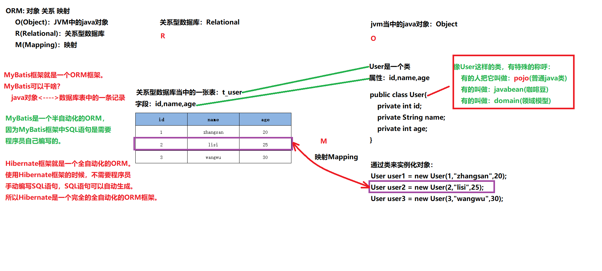

# Mybatis概述

## JDBC的不足

- sql语句一旦被编译，不好进行拓展增加查询字段时，要修改java代码再编译打包等等
- 问号传值繁琐
- 遍历结果集封装数据繁琐

## 了解Mybatis

- 使用的版本是 3.5.10

- mybatis的maven坐标

  ```xml
  <!-- https://mvnrepository.com/artifact/org.mybatis/mybatis -->
  <dependency>
      <groupId>org.mybatis</groupId>
      <artifactId>mybatis</artifactId>
      <version>3.5.10</version>
  </dependency>
  ```

- Mybatis只有一个核心jar文件,导入依赖就可以使用这个框架了

- 认识ORM思想

- mybatis就是实现orm的一个框架

# MyBatis入门程序

- 组件版本

  ```xml
  <!--我自己有,-->
  Mysql驱动 5.17
  
  MyBatis 3.5.10
  <!-- https://mvnrepository.com/artifact/org.mybatis/mybatis -->
  <dependency>
      <groupId>org.mybatis</groupId>
      <artifactId>mybatis</artifactId>
      <version>3.5.10</version>
  </dependency>
  
  logback 1.2.11
  ```

- 直接放到resources目录的东西，相当于放到类的根路径下

- 大部分核心笔记在每章的readme.txt中

  ```markdown
  开发我的第一个MyBatis程序
  
  
  1. resources目录
      放到这个目录当中的，一般都是资源文件配置文件
      直接放到resources目录的东西，相当于放到类的根路径下
  
  
  2. 开发步骤
  * 第一步-打包jar
  * 第二部-添加依赖
          mybatis依赖
          mysql依赖
  * 第三步-编写mybatis核心配置文件: mybatis-config.xml
      注意
          第一, 这个名字是大家都这样命名
          第二, 这个文件一般放到类的根路径下
      配置信息不懂,没事,先修改
  * 第四步-编写XxxMapper.xml文件
      在这个文件中编写sql语句
      这个文件名和放的位置并不固定
  * 第五步-在mybatis-config.xml文件中指定XxxMapper.xml文件的路径
      <mapper resource="org/mybatis/example/BlogMapper.xml"/>
      注意: resource属性会自动从类的根路径开始查找资源
  * 第六步-编写mybatis程序
      在Mybatis中,负责在mybatis负责执行sql语句的对象是?
          SqlSession
      SqlSession是专门用来执行sql语句的,是java程序和数据库之间的一次会话
      要想获取SqlSession对象,要先获取SqlSessionFactory工厂来生产SqlSession对象
      怎么获取SqlSessionFactory对象呢?
          首先先获取SqlSessionFactoryBuilder对象
          通过SqlSessionFactoryBuilder对象的build方法,来获取一个SqlSessionFactory对象
  
      mybatis的核心对象包括:
          SqlSessionFactoryBuilder
          SqlSessionFactory
          SqlSession
  
      SqlSessionFactoryBuilder --> SqlSessionFactory --> SqlSession
  
  
  3. 从XML中构建SqlSessionFactory
      很重要的对象:
      这个对象需要xml构建
  
  
  4. mybatis有两个主要的配置文件
      mybatis-config.xml 这是核心配置文件,主要配置连接数据库的信息等
      另一个是 XxxMapper.xml 这个文件一般是一张表一个
  
  5. 第一个程序的小细节
      * XxxMapper.xml中sql语句的结尾; 可写可不写
      * Resources.getResources.getResourceAsStream
          小技巧: 以后凡是遇到resource单词, 大部分情况下,这种加载资源方式是从类的根路径下查找资源的
          优点
              可移植性强, 路径不需要移植后修改
      * 用IO流就必须是绝对路径, 可移植性差
      * 已经验证了:
          mybatis的核心配置文件, 名字以及存放路径, 都并不是固定的
      * InputStream is = ClassLoader.getSystemClassLoader().getResourceAsStream("mybatis-config.xml");
          ClassLoader.getSystemClassLoader()是类加载器,
          getResourceAsStream()方法来加载类的根路径下的资源!
          通过源代码分析发现:
              Resources.getResourceAsStream("mybatis-config.xml");
          底层就是调用了
              ClassLoader.getSystemClassLoader().getResourceAsStream("mybatis-config.xml");
      * CarMapper.xml文件的名字是固定的吗?其路径是固定的吗?
          都不是固定的
          <mapper url="file:///d:/a.txt"/>    url属性: 从绝对路径中加载
          <mapper resource="com/CarMapper2.xml"/>    resource属性:从类的根路径下加载
  
  6. 研究mybatis事务管理机制的深度剖析
      * 在mybatis-config.xml文件中, 可以通过以下的配置进行mybatis的事务管理
           <transactionManager type="JDBC"/>
      * type属性的值包括两个:
          JDBC
          MANAGED
          不区分大小写
      * 在mybatis中提供了两种事务管理机制
          第一种: JDBC事务管理器
          第二种: MANAGED事务管理器
      * JDBC事务管理器
          mybatis框架自己管理事务,自己采用原生的jdbc代码去管理事务
  
          跟踪openSession()-->openSessionFromDataSource()
              -->newTransaction()-->new JdbcTransaction()
                  -->跟踪autoCommit属性-->跟踪openConnection()-->setDesiredAutoCommit()
  
          mybatis默认是开启了事务的,一般情况下需要你手动提交, 如果你需要自动提交(或者说不开启事务),写true
              SqlSession sqlSession = sqlSessionFactory.openSession(true);
              跟踪源码可知
  
      * mybatis事务管理器
          mybatis不再负责事务的管理,事务管理交给其他容器来负责.例如spring
  
          对于现在只有jdbc的情况下, 如果你设置成managed, 那么相当于现在在关闭了事务是一样的效果
  
      * JDBC中的事务:
          如果没有在jdbc代码中执行conn.setAutoCommit(false);的话,默认是true即自动提交
  
      *   重要:
          setAutoCommit(true) -- 自动提交, 没有事务
          setAutoCommit(false) -- 不自动提交, 开启事务
          
  ```

  

