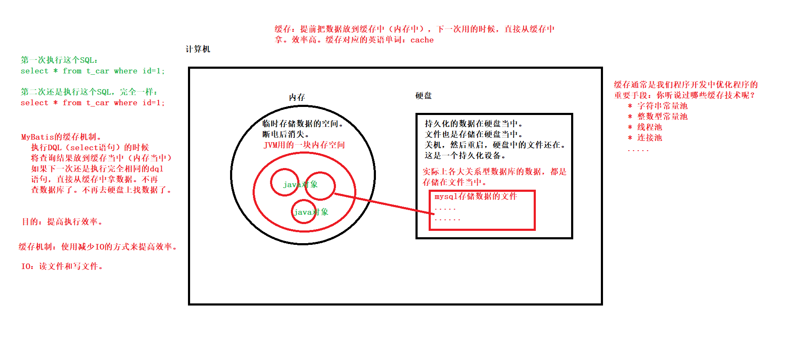
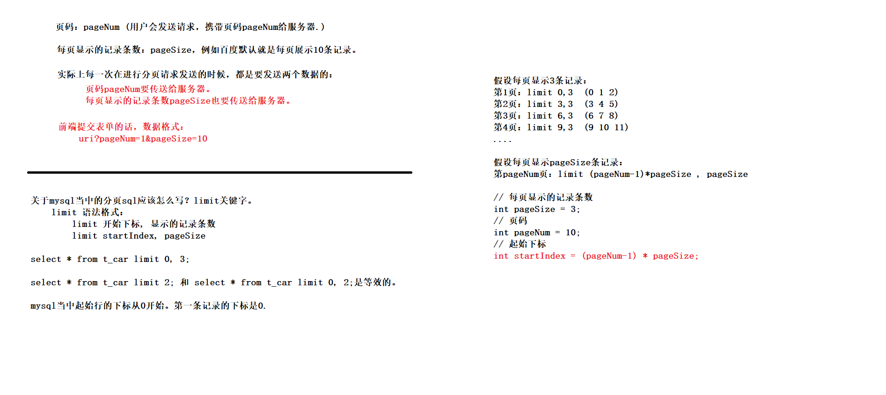

# Mybatis概述

## JDBC的不足

- sql语句一旦被编译，不好进行拓展增加查询字段时，要修改java代码再编译打包等等
- 问号传值繁琐
- 遍历结果集封装数据繁琐

## 了解Mybatis

- 使用的版本是 3.5.10

- mybatis的maven坐标

  ```xml
  <!-- https://mvnrepository.com/artifact/org.mybatis/mybatis -->
  <dependency>
      <groupId>org.mybatis</groupId>
      <artifactId>mybatis</artifactId>
      <version>3.5.10</version>
  </dependency>
  ```

- Mybatis只有一个核心jar文件,导入依赖就可以使用这个框架了

- 认识ORM思想

- mybatis是实现orm的一个框架

# MyBatis入门程序

- 组件版本

  ```xml
  <!--我自己有,-->
  Mysql驱动 5.17
  
  MyBatis 3.5.10
  <!-- https://mvnrepository.com/artifact/org.mybatis/mybatis -->
  <dependency>
      <groupId>org.mybatis</groupId>
      <artifactId>mybatis</artifactId>
      <version>3.5.10</version>
  </dependency>
  
  logback 1.2.11
  ```

- 直接放到resources目录的东西，相当于放到类的根路径下

- 大部分核心笔记在每章的readme.txt中

# 使用mybatis完成CRUD

- javaweb mvc那部分完成crud的代码
  - insert(Account act)
  - delete(Long id)
  - updete(Account act)  传入是一个对象
  - selectById(Long id)
  - selectAll()
- 使用mybatis完成crud的时候也是同上


# mybatis的configuration


# 手写框架（听）

- 跳过了，以后再补

# 在web项目中使用mybatis

# 面向接口编程完成crud

- 在web项目使用mybatis的不足之一： dao的源码其实很固定，我能不能不写？

  ```java
  /**
  * 这是没有使用mybatis面向接口编程的时,需要写dao文件
  */
  public class AccountDaoImpl implements AccountDao {
      
      @Override
      public Account selectByActno(String Actno) {
          //使用mybatis
          SqlSession sqlSession = SqlSessionUtil.openSession();
          //执行sql语句
          Account act = sqlSession.selectOne("AccountMapper.selectByActno", Actno);
          return act;
      }
  
      @Override
      public int updateByActno(Account act) {
          //使用mybatis
          SqlSession sqlSession = SqlSessionUtil.openSession();
          //执行sql
          int count = sqlSession.update("updateByActno", act);
          return count;
      }
  }
  
  ```

- 答案是可以, javassist技术可以帮我们通过代码来创建一个实现接口和接口方法的实现类

- 什么是javassist?

  - //

- 使用javasist创建一个类并且调用类中方法

  ```java
  //获取类池
  ClassPool pool = ClassPool.getDefault();
  //创建类
  CtClass ctClass = pool.makeClass("CtClassByJavassist");
  //创建方法
  String methodCode =
          "public void hello(){" +
          "System.out.println(\"Hello World!\");" +
          "}";
  CtMethod ctMethod = CtMethod.make(methodCode, ctClass);
  //添加到类中
  ctClass.addMethod(ctMethod);
  //在内存中生成class
  ctClass.toClass();  //事实上这个toClass()方法会返回一个class对象
  
  //反射机制
  Class<?> clazz = Class.forName("CtClassByJavassist");
  //创建对象
  Object obj = clazz.newInstance();
  //获取其方法
  Method method = clazz.getDeclaredMethod("hello");
  //调用
  method.invoke(obj);
  //打印信息
  System.out.println(obj);
  
  /** 控制台信息
  * Hello World!
  * CtClassByJavassist@22f71333
  */
  ```

- 使用javasist创建一个实现AccountDao接口的实现类

  ```java
  //获取类池
  ClassPool pool = ClassPool.getDefault();
  //制造类
  CtClass ctClass = pool.makeClass("com.bjpowernode.dao.impl.AccountDaoImpl");
  //制造接口 ?为什么要制造接口而不能获取一个已有的接口呢
  CtClass ctInterface = pool.makeInterface("com.bjpowernode.dao.AccountDao");
  //添加接口到类中 AccountDaoImpl implements AccountDao
  ctClass.addInterface(ctInterface);
  //实现接口中的方法-制造方法
  String methodCode =
  	"public void hello(){" +
  	"System.out.println(\"Hello World2!\");" +
  	"}";
  CtMethod ctMethod = CtMethod.make(methodCode, ctClass);
  //将方法添加到类中
  ctClass.addMethod(ctMethod);
  //在内存中生成类, 同时将生成的类加载到JVM当中
  Class<?> clazz = ctClass.toClass();
  AccountDao accountDao = (AccountDao) clazz.newInstance();
  accountDao.hello();
  ```

- 以上两个例子的区别在哪里？

  - 第二个例子比起第一个例子多了 制造接口， 实现接口以及生成类后的向上转型直接调用方法 这些步骤
  - 最重要的是，第二个例子生成的类因为实现了接口，可以直接调用接口的方法（方法的动态绑定机制） 
  - 第一个例子，因为没有实现接口，在编译阶段是找不到一个叫CtClassByJavassist的类的，也就不能在编译阶段直接调用方法，全程要使用反射

- 怎么去动态拼出一个方法（重点）

  - 实现接口ctClass.addInterface()  本质上是  AccountDaoImpl implements AccountDao

  - 为什么不能自己引入一个接口，而必须使用javasist制造接口？

    - 一是javasist没有这个api
    - 二是javasist已经规定好了必须制造接口这一步，因为制造接口的目的就是为了去实现 `XxxDaoImpl implemets XxxDao`, 自己引入还得去封装javasist的CtInterface对象.

  - ```java
    @Override
        public Account selectByActno(String Actno) {
            //使用mybatis
            SqlSession sqlSession = SqlSessionUtil.openSession();
            //执行sql语句
            Account act = sqlSession.selectOne("AccountMapper.selectByActno", Actno);
            return act;
        }
    
        @Override
        public int updateByActno(Account act) {
            //使用mybatis
            SqlSession sqlSession = SqlSessionUtil.openSession();
            //执行sql
            int count = sqlSession.update("updateByActno", act);
            return count;
        }
    ```

  - 为什么要传入接口的字节码对象?

    - 因为你拼串需要拼 方法的返回类型
    - 拼 方法的名字
    - 拼 参数列表

  - 我怎么知道调用sqlSession的update还是selectOne还是selectList还是insert?

    - `SqlCommandType sqlCommandType = sqlSession.getConfiguration().getMappedStatement(sqlId).getSqlCommandType();`
    - 所以需要sqlSession对象

  - 我怎么知道该拼什么的sqlId?

    - sql语句的id是框架的使用者提供的, 具有多变性, 对于我框架的开发人员来说. 我不知道
    - 既然我框架开发者不知道sqlId, 怎么办呢? mybatis框架的开发者于是出台一个规定: 凡是使用次框架机制的
    - sqlId都不能随便写. namespace必须是dao接口的全限定名称.id必须是dao接口中的方法名

- 给定一个dao接口, 自动生成具有crud功能的dao实现类的部分实现源码

  ```java
  public class GenerateDaoProxy {
      public static Object generate(SqlSession sqlSession, Class<?> daoInterface) {
  // 获取类池
  ClassPool pool = ClassPool.getDefault();
  //制造类(com.powernode.bank.dao.AccountDao --> com.powernode.bank.dao.AccountDaoProxy)
  CtClass ctClass = pool.makeClass(daoInterface.getName() + "Proxy");
  //制造接口
  CtClass ctInterface = pool.makeInterface(daoInterface.getName());
  //实现接口
  ctClass.addInterface(ctInterface);
  //制造方法-1实现接口中所有的方法
  Method[] methods = daoInterface.getDeclaredMethods();
  Arrays.stream(methods).forEach(method -> {
      //method是接口中的抽象方法
      // 将method这个抽象方法进行实现
      try {
          // Account selectByActno(String actno);
          // public Account selectByActno(String actno){代码;}
          StringBuilder methodCode = new StringBuilder();
          methodCode.append("public ");
          methodCode.append(method.getReturnType().getName());
          methodCode.append(" ");
          methodCode.append(method.getName());
          methodCode.append("(");
          // 拼参数列表
          Class<?>[] parameterTypes = method.getParameterTypes();
          for (int i = 0; i < parameterTypes.length; i++) {
              Class<?> parameterType = parameterTypes[i];
              methodCode.append(parameterType.getName());
              methodCode.append(" ");
              methodCode.append("arg" + i);
              if (i != parameterTypes.length - 1) {
                  methodCode.append(",");
              }
          }
          methodCode.append(")");
          methodCode.append("{");
          // 拼方法体代码
          methodCode.append("org.apache.ibatis.session.SqlSession sqlSession = bank.utils.SqlSessionUtil.openSession();");
          //  需要中的是什么类型的sql语句
          //  sql语句的id是框架的使用者提供的, 具有多变性, 对于我框架的开发人员来说. 我不知道
          //  既然我框架开发者不知道sqlId, 怎么办呢? mybatis框架的开发者于是出台一个规定: 凡是使用次框架机制的
          //  sqlId都不能随便写. namespace必须是dao接口的全限定名称.id必须是dao接口中的方法名
          String sqlId = daoInterface.getName() + "." + method.getName();
          SqlCommandType sqlCommandType = sqlSession.getConfiguration().getMappedStatement(sqlId).getSqlCommandType();
          if (sqlCommandType == SqlCommandType.INSERT) {
  
          }
          if (sqlCommandType == SqlCommandType.DELETE) {
  
          }
          if (sqlCommandType == SqlCommandType.UPDATE) {
              methodCode.append("return sqlSession.update(\"" + sqlId + "\", arg0);");
          }
          if (sqlCommandType == SqlCommandType.SELECT) {
              String returnType = method.getReturnType().getName();
              methodCode.append("return (" + returnType + ") sqlSession.selectOne(\"" + sqlId + "\", arg0);");
          }
          methodCode.append("}");
          //制造方法-2
          String methodCode_Str = methodCode.toString();
          CtMethod ctMethod = CtMethod.make(methodCode_Str, ctClass);
          //将方法添加到类中
          ctClass.addMethod(ctMethod);
          } catch (Exception e) {
              throw new RuntimeException(e);
          }
      });
      //在内存中生成类, 同时将生成的类加载到JVM中
      Object obj = null;
      try {
          Class<?> clazz = ctClass.toClass();
          obj = clazz.newInstance();
      } catch (Exception e) {
          e.printStackTrace();
      }
      return obj;
      }
  }
  ```

- 以上就是mybatis自动实现dao实现类的基本逻辑
- 此后,编写mybatis的步骤变成
  - 编写XxxMapper接口和编写XxxMapper.xml, 不再写dao实现类
    - 接口和文件有明确的规定: 
      - xml的namespace必须是接口的全限定接口名 
      - xml的sqlId必须是接口的方法名
  - 使用sqlSession.getMapper(Class<?> daoInterface) 获取dao实现类
    - 使用接口的方法, 来调用sql语句,并且接收mysql处理结果

# Mybatis小技巧

# Mybatis参数处理

- 接下来讲的参数处理是什么意思?

  - 我们目前的编写sql语句是面向接口开发, 当我们调用接口的方法(动态绑定到实现类中的方法)时, 通过参数传给方法 --> sqlSession.insert("sqlId",  obj) --> insert into t_car values(null, #{carNum},#{brand},#{guidePrice},#{produceTime},#{carType})  `然后mybatis解析这条sql, #{carNum}解析成? 并且自动ps.set(1,obj.getCarNum())`以此类推
  - 也即是说, mybatis应对不同的obj, 解析出需要的数据的

- 传一个简单类型参数

  - 例子(简单类型是都可以被mybatis的自动类型推断机制推断的)

    - 单个参数Long类型

      ```xml
      <!--
      parameterType属性的作用:
      高数mybatis,我在这个方法的参数类型是什么
      mybatis框架自带类型自动推断机制,所以大部分情况下可以不写这个属性
      
      Sql语句最终是这样的:
      select * from t_student where id = ?
      
      JDBC代码是一定要给?传值.
      怎么传值? ps.setXxx(第几个问好, 传什么值)
          ps.setString(1,"1");
          ps.setInt(1,1);
      
      mybatis实际上对java基本类型都内置了别名,参考开发手册
      -->
      <select id="selectById" resultType="Student" parameterType="java.lang.Long">
          select *
          from t_student
          where id = #{id};
      </select>
      ```

      ```xml
      <!--
      #{name, javaType=String, jdbcType=VARCHAR}同样是告诉mybatis参数的类型,不需要自动类型推断
      -->
      <select id="selectByName" resultType="Student">
          select *
          from t_student
          where `name` = #{name, javaType=String, jdbcType=VARCHAR};
      </select>
      ```

    - 单个参数Date类型

    - Map集合

    - Pojo类

  - 单个简单类型的#{xx}xx可以随便写

  - Map集合和Pojo类的#{}里面不能随便写, 要么是key名,要么是属性名

- 传入多参数

  - ```java
    /**
     * 多参数
     * 根据name和sex查询student信息
     * 如果是多个参数的话,mybatis框架底层是怎么做的呢?
     * mybatis框架会自动创建一个Map集合. 并且Map集合是以这种方式存储参数的
     *     map.put("arg0", name);
     *     map.put("arg1", sex);
     *     map.put("param1", name);
     *     map.put("param2", sex);
     * @param name
     * @param sex
     * @return
     */
    List<Student> selectByNameAndSex(String name, Character sex);
    ```

  - mybatis底层自动创建map后, 原来的#{name}和#{sex} 就失效了

    - 就必须使用以上的key名

  - @Param注解改进key名, 增加可读性

    - ```java
      /**
       * 使用注解代替多参数中的arg0param1等等
       * 注解中value属性可以省略
       *
       * mybatis框架底层的实现原理:
       *      map.put("arg0",name);
       *      map.put("arg1",sex);
       *      arg0 arg1会被替换, param1 param2不会被替换任然存在
       *      map.put("name",name);
       *      map.put("sex",sex);
       * @param name
       * @param sex
       * @return
       */
      List<Student> selectByNameAndSex2(@Param(value="name")String name,@Param("sex") Character sex);
      ```

    - 

- mybatis是如何拿到参数,传给sql语句的?
  - 传入一个简单数据类型数据
  - 传入一个pojo对象
  - 传入一个map对象

# 查询专题

- 梳理之前的

  - 返回一个Car
  - 返回多个Car
  - 返回但用List<Car>接收一个Car

- 当查询的数据没有合适的pojo接收时

  - 返回一个Map
  - 返回多个Map  `List<Map<String, Object>>`
  - 返回大Map(解决多个Map不好查找的问题)  `Map<Long, Map<String,Object>>`
    - 需要在接口的那个方法上使用注解  `@MapKey("id")//将查询结果的id值作为整个大Map集合的key`
    - resultType="java.lang.Map", 因为里面还是封装的是Map

- 解决pojo属性名与数据库表列名不一致导致的查询问题

  - 一是使用别名

  - 二是使用resultMap标签

    - ```xml
      <!--
      1. 专门定义一个结果映射,在这个结果映射当中指定数据库表的字段名和java类的属性名的对应关系
      2. type属性: 用来指定Pojo类的类名
      3. id属性: 指定resultMap的唯一标识.这个id将来要在select标签中使用
      -->
      <resultMap id="carResultMap" type="pojo.Car">
          <!--如果数据库表中有主键，一般都是有主键，要不然不符合数据库设计第一范式。-->
          <!--如果有主键，建议这里配置一个1d标签，注音，这不是必须的，但是官方的解释是什么呢， 这样的配蛋可以让myhati提高效率-->
          <id property="id" column="id"/>
          <!--property后面写POJO类的属性名-->
          <!--column后面填写数据库表中的字段名-->
          <result property="carNum" column="car_num" javaType="string" jdbcType="VARCHAR"/>
          <!--如果column和property一样可以不配置-->
          <!--<result property="brand" column="brand"/>-->
          <result property="guidePrice" column="guide_price"/>
          <result property="produceTime" column="produce_time" javaType="string" jdbcType="CHAR"/>
          <result property="carType" column="car_type" javaType="string" jdbcType="VARCHAR"/>
      </resultMap>
      
      <!--select标签的resultMap属性, 用来指定使用哪个结果映射.resultMap后面的值是resultMap的id-->
      <select id="selectAllByResultMap" resultMap="carResultMap">
          select * from t_car;
      </select>
      ```

  - 三是开启驼峰命名自动映射 (配置settings)

    - 前提是遵守两个规范:

      - Java命名规范：⾸字⺟⼩写，后⾯每个单词⾸字⺟⼤写，遵循驼峰命名⽅式。
      - SQL命名规范：全部⼩写，单词之间采⽤下划线分割。

    - 在mybatis-config核心配置文件中, 写

      - ```xml
        <!--放在properties标签后⾯-->
        <settings>
         <setting name="mapUnderscoreToCamelCase" value="true"/>
        </settings>
        ```

# 动态Sql

- 动态SQL就是 拼接sql语句
- 动态sql的使用场景：
  -  

- if标签
  - 需求：根据品牌，知道价格，汽车类型
  - 
- where标签
  - 作用：让where子句更加智能。
    - 所有条件为空时，where标签保证不会生成where字句
    - 自动去除某些条件前面多余的and或or（要在前面的）

- trim标签
  - 作用：智能添加内容前后缀，删除前后缀
    - 判断内容有无在加前缀
- set标签
  - 需求：比如只更新提交的不为空。。。
  - 作用：


- choose when otherwise

  - 需求
  - 作用
  - 三个标签通常一起使用，等效于 if-else if-else

- foreach

  - 批量删除
  - 批量插入
  - 批量删除的第二种方式

- sql标签和include标签

  - 把需要需用的用sql包裹

    - ```xml
      <sql id="sql1">
      	需要需用的sql语句片段...
      </sql>
      ```

  - 用include放到其他语句中

    - ```xml
      <include refid="sql1" />
      ```

# 高级映射

- 之前学习的都是普通映射: 对单表的crud

- 多对一,一对多

- 环境搭建
  - 建表
  - 加依赖
  - 准备一些配置文件, 工具类
  - 编写pojo,mapper接口, mapper映射文件

- 多对一映射实体类关系怎么设计(两张表怎么映射一个对象)
  >
  >
  >- 明确主对象副对象,主表和副表	
  >- 以MyStudent对象作为主对象, 有一个属性是MyClass

- 多对一映射的三种实现方式
  - 第一种方式：一条Sql语句，级联属性映射

  - 第二种方式：一条SQL语句，association

  - 第三种方式：两条SQL语句，分布查询。(常用; 优点可复用和支持懒加载)
    - 在内存设计上, 一个班级有多个学生, 所以班级是一,学生是多;
    
      如果选择多对一的映射方式, 多在一前面,所以学生是主表,班级是副表
    
    - MyStudentMapper.xml
    
      ```xml
      <!--两条sql语句,完成多对一的分布查询-->
      <!--这里是第一步: 根据学生的id查询学生的所有信息。这些信息当中含有班级id (cid)-->
      <!--多对一:-->
      <resultMap id="selectByIdStep1ResultMap" type="MyStudent">
          <id property="sid" column="sid"/>
          <result property="sname" column="sname"/>
          <!--
          property是pojo类的属性
          select是指定另外第二部sql语句的sqlid
          column是第一步sql查出来的列名 作为参数传给第二步sql
          -->
          <association property="myClass"
               select="mapper.MyClassMapper.selectByIdStep2"
               column="cciidd"
               fetchType="eager"/>
      </resultMap>
      <select id="selectByIdStep1"
              resultMap="selectByIdStep1ResultMap">
          select sid, sname, cid as cciidd
          from t_stu
          where sid = #{sid}
      </select>
      ```
    
    - MyClassMapper.xml
    
      ```xml
      <!--多对一:分布查询第二步,根据cid获取班级信息-->
      <!--这里其实不需要resultMap可以直接使用resultType="MyClass"-->
      <resultMap id="MyClassResultMap" type="MyClass">
          <id property="cid" column="cid"/>
          <result property="cname" column="cname"/>
      </resultMap>
      <select id="selectByIdStep2" resultMap="MyClassResultMap">
          select cid, cname
          from t_class
          where cid = #{cid};
      </select>
      ```
    
    - 要把sql语句查询的结果映射成一个对象,作为主表的属性`使用assocaition标签`
    
      ```xml
      <!--
      property是要把结果映射成主表pojo类的属性
      select是指定另外第二部sql语句的sqlid
      column是第一步sql查出来的列名 作为参数传给第二步sql
      -->
      <association property="myClass"
               	 select="mapper.MyClassMapper.selectByIdStep2"
               	 column="cciidd"
               	 fetchType="eager"/>
      ```
  
- 一对多映射实体类关系怎么设计
  >
  >

- 一对多映射的三种实现方式

  - 第一种方式：collection
  - 第二种方式：两条sql语句分步查询
  
    - 在内存设计上, 一个班级指向多个学生, 所以班级是一,学生是多;
  
      如果选择一对多的映射方式, 一在多前面,所以班级是主表,学生是副表

------

# 缓存



- 缓存范围
  - 一级缓存
  - 二级缓存
- 一级缓存使用
- 一级缓存失效
  - 
- 二级缓存使用条件
  - 默认二级缓存开启
  - 只需要在对应的mapper.xml使用`<cache/>`标签
  - 使用二级缓存的pojo类必须实现可序列化接口
  - sqlSession对象关闭才会把一级缓存放到二级缓存
- 继承Ehcache
  - 是为了代替mybatis自带的二级缓存，一级缓存是不能代替的
  - 使用
  - type=""

------


# 逆向工程

- 简单，只需要用别人的组件
- 根据表动态生成pojo mapper mapper.xml

- 环境搭建
- 使用步骤
  - 配插件依赖；项目依赖
  - 双击执行就生成好，pojo mapper接口 mapper文件了


# 分页查询



```sql
-- limit:起始下标(从0开始, 如果是0可以省略不写), 要取几条数据
select * from t_car limit 0,3
```

- 手写需要的原理
  - 必须拿到前端传给我的两个数据: 第几页和每页要多少条\
  - limit的算法
- 获取数据不难,获取分页相关的数据比较难. 可以借助pageHelper
- 使用步骤
  - 依赖
- 基本分页功能
- 分页信息对象

# 注解开发

- 如果用注解, mapper.xml文件可以不写了; 但是官方建议简单的单表crud使用注解,复杂sql语句还是要使用xml来映射sql
- @Insert
- @Delete
- @Select
- @Update
- @Results
  - @Result property column

- 高级映射复习
- 准备spring的资料
